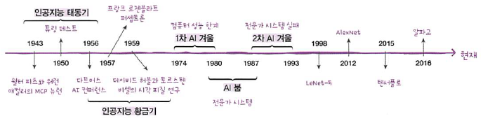

01-1 인공지능과 머신러닝, 딥러닝

- **Keywords**
    - **인공지능**: 사람처럼 학습하고 추론할 수 있는 지능을 가진 시스템을 만드는 기술
    - **머신러닝**: 프로그래밍하지 않아도 자동으로 데이터에서 규칙을 학습하는 알고리즘
    - **딥러닝**: 인공 신경망

## 인공지능의 역사

- 1차: 알고리즘은 준비가 됐으나 HW 적으로 문제가 발생
- 2차: 전문가 시스템에서 오류가 발생

## 인공지능이란

- **앨런 튜링**(Alan Turing) - 튜링 테스트

    사람처럼 배울 수 있다는 것을 증명.

- [**퍼셉트론(Perceptron)**](https://wikidocs.net/24958)

    실제 뇌를 구성하는 신경 세포 뉴런의 동작과 유사.

    뉴런은 가지돌기에서 신호를 받아들이고, 이 신호가 일정치 이상의 크기를 가지면 축삭돌기를 통해서 신호를 전달한다.

    즉, 신호를 전달하는 가장 최소 단위.

    입력값과 출력값 그리고 가중치를 가진다. (x, y, W)

- **인공일반지능 or 강인공지능**

    흔히 영화 속에서 등장하는 인공지능 (e.g. [<그녀>의 사만다](https://ko.wikipedia.org/wiki/%EA%B7%B8%EB%85%80_(%EC%98%81%ED%99%94)) , <터미네이터>의 스카이넷)

- **약인공지능**

    특정 분야에서 사람의 일을 도와주는 보조 역할만 가능 (e.g. 음성 비서, 자율주행자동차, 알파고)

    [e.g. siri]
    지도 학습을 통해 개발을 시작함 → key값이 없는 데이터를 수집 → 보완

## 머신러닝이란

- 프로그래밍 하지 않아도 자동으로 데이터에서 규칙을 학습하는 알고리즘을 연구
- 인공지능의 분야 중에서 **지능**을 구현하기 위한 소프트웨어를 담당
- 통계학과 깊은 관련

- **하지만,** 최근 머신러닝의 발전은 통계나 수학 이론보다 **경험**을 바탕으로 발전하는 경우가 많음.
- 대표적인 라이브러리는 [사이킷런(scikit-learn)](https://scikit-learn.org/stable/)이다.
- **API: A**pplication **P**rogramming **I**nterface, 응용 프로그램에서 사용할 수 있도록, 운영 체제나 프로그래밍 언어가 제공하는 기능을 제어할 수 있게 만든 인터페이스
참고: [https://www.w3schools.com/](https://www.w3schools.com/)

## 딥러닝이란

- 인공 신경망을 기반으로 한 방법들을 통칭
- 종종 사람들은 인공 신경망과 딥러닝을 크게 구분하지 않고 사용한다.
- Yann Lecun

    신경망 모델을 만들어 손글씨 숫자를 인식하는데 성공

    [LeNet-5](https://my-coding-footprints.tistory.com/97): 최초의 합성곱 신경망

- Geoffrey Hinton

    [ImageNet](http://www.image-net.org/)에서 기존의 머신러닝 방법을 누르고 우승

    AlexNet: 합성곱 신경망 사용

- 오픈소스 머신러닝 라이브러리

    TensorFlow: 2015년 구글

    PyTorch: 2018년 페이스북

    공통점: 인공 신경망 알고리즘을 전문으로 다루고 있음 + 사용하기 쉬운 API 제공